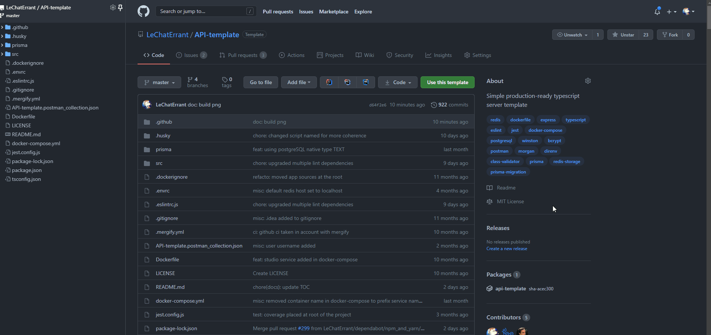

# API-template

# What is it ?

The purpose of this template is to provide a **typesafe**, **production ready** web API, and a full **development environment** with the best tooling possible

It gives your project a clean base to start and follows development **good practices**, essentially focusing on **maintenability** and **extensibility**

Lastly, it aims to save developers a lot of time since all **nasty configurations** are already written (typescript, eslint, jest, docker, CI, ...) and **technologies** are already chosen (language, testing framework, database, ORM, ...)

This project is fully integrated with
- **[front-template](https://github.com/LeChatErrant/front-template)**, a modern typescript frontend stack
- **[ops-template](https://github.com/LeChatErrant/ops-template)**, a complete scalable infrastructure on Kubernetes along with its tooling

> Don't hesitate to share your improvements or to give feedback on Discord **(LeChatErrant#6074)** :wink:

<!-- START doctoc generated TOC please keep comment here to allow auto update -->
<!-- DON'T EDIT THIS SECTION, INSTEAD RE-RUN doctoc TO UPDATE -->
# Table of contents

- [Documentation](#documentation)
- [Deployment](#deployment)
- [Getting started](#getting-started)
- [Technologies](#technologies)
- [CLI](#cli)
- [How to reuse this template](#how-to-reuse-this-template)
- [Work in progress](#work-in-progress)
- [How to contribute](#how-to-contribute)
  - [Contributors](#contributors)

<!-- END doctoc generated TOC please keep comment here to allow auto update -->

# Documentation

Documentation can be found in the **[wiki](https://github.com/LeChatErrant/API-template/wiki)**

# Deployment

API is deployed on **[Heroku](https://www.heroku.com)** and can be reached on **[api-template-prod.herokuapp.com](https://api-template-prod.herokuapp.com)**

Additionally, a public **[Postman](https://www.postman.com/)** workspace is available on **[www.postman.com/LeChatErrant/workspace/api-template](https://www.postman.com/LeChatErrant/workspace/api-template)** to let you try the API

For a complete scalable deployment, see **[ops-template](https://github.com/LeChatErrant/ops-template)**

# Getting started

1. Make sure the **[.envrc](/.envrc)** is loaded (have a look **[here](https://github.com/LeChatErrant/API-template/wiki/Getting-started#Configuration)**)
2. Install dependencies with `npm install`
3. Launch a local database with `npm run dev:db`
4. Run `npm run dev`

# Technologies

 - **[Typescript](https://www.typescriptlang.org/)** : Language
 - **[Express](https://expressjs.com/)** : Web server
 - **[Heroku](https://www.heroku.com)** : Application hosting
 - **[Prisma](https://www.prisma.io/)** : ORM
 - **[Prisma studio](https://www.prisma.io/studio)** : Database visualisation
 - **[Prisma migrate](https://www.prisma.io/migrate)** : Database migration
 - **[Prisma data platform](https://www.prisma.io/dataplatform)** : Database hosting
 - **[Bcrypt](https://www.npmjs.com/package/bcrypt)** : Password hashing
 - **[Eslint](https://eslint.org/)** : Code styling
 - **[Jest](https://jestjs.io/)** : Testing
 - **[Supertest](https://www.npmjs.com/package/supertest)** : Endpoint testing
 - **[Class validator](https://github.com/typestack/class-validator)** : DTO validation
 - **[Winston](https://github.com/winstonjs/winston)** : Logger
 - **[Husky](https://typicode.github.io/husky/#/)** : Pre commit hooks
 - **[Github action](https://github.com/features/actions)** : CI / CD
 - **[Docker](https://www.docker.com/)** : Containerization
 - **[Redis](https://redis.io/)** : Session management
 - **[PostgreSQL](https://www.postgresql.org/)** : Database

...and more

# CLI

The template comes with a **[Command-Line Interface](https://github.com/LeChatErrant/templated-project-cli)** that helps you to **initialize**, **develop** and **maintain** your projects. It saves you from writing boilerplate code 

> The CLI is currently under heavy development, new features will be release soon ❤️
> 
> More details in **[wiki](https://github.com/LeChatErrant/API-template/wiki/CLI)**

# How to reuse this template

This repository is **templated** : try using it as a base for your own projects by clicking on the **[Use this template](https://github.com/LeChatErrant/API-template/generate)**

# Work in progress

 - [ ] CLI to create, extend and manage API resources
 - [ ] Auto generated code documentation
 - [ ] Integration with Prisma seeders
 - [ ] Back office template

# How to contribute

1. Fork it (**<https://github.com/LeChatErrant/API-template/fork>**)
2. Create your feature branch (`git checkout -b my-new-feature`)
3. Commit your changes (`git commit -am 'Add some feature'`)
4. Push to the branch (`git push origin my-new-feature`)
5. Create a new Pull Request

Issues and comments welcomed ! :wink:

## Contributors

 &nbsp; **[LeChatErrant](https://github.com/LeChatErrant)** - creator and maintainer
