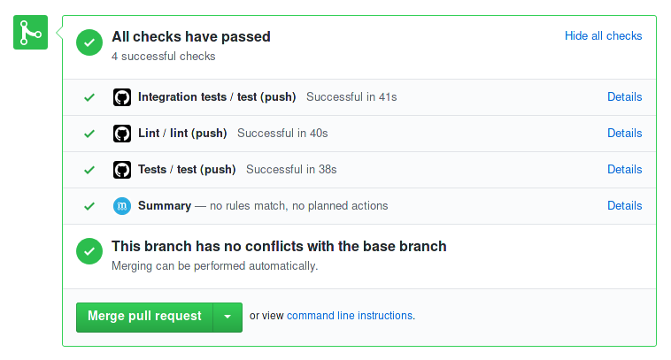
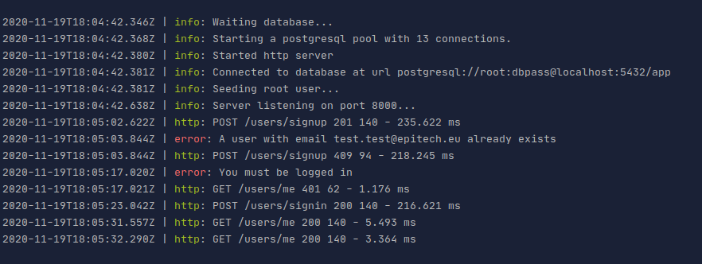

# API-template


Production-ready API template

<details>
<summary><b>About the "templated" project</b></summary>

<!--ts-->

## Who

> First of all, hello. I'm [LeChatErrant](https://github.com/LeChatErrant), software engineer studying at Epitech Paris, creator and maintainer of [API-template](https://github.com/LeChatErrant/API-template)
>
> I'm currently working at [Tresorio](https://tresorio.com/), a green cloud-computing startup, at the position of lead-developer of the cloud-rendering branch (distributed computing for 3D animation)
>
> Passionate by the design of backend software and distributed systems, I'm aiming to offer tools to help building the most complete architecture possible

Don't hesitate to share your improvements or to give me feedback on Discord at LeChatErrant#6074 ;)

## What

The "templated" project is divided into 4 parts :
 - [API-template](https://github.com/LeChatErrant/API-template)
 - back-office-template (coming soon)
 - [devops-template](https://github.com/LeChatErrant/API-template)
 - cli (wip)

## Why

**Starting a whole new project from scratch is painfully.** You have to
 - Choose between multiple technologies
 - Write nasty configurations
 - Adopt a coding style
 - Enforce good practices
 - Setup a lot of tooling
 - Make sure future developers will follows established guidelines, to keep the project maintainable

Those **decisions** are often poorly made at first and lead to multiple refacto, since
 - Your skills evolves along with the project
 - You learn new technologies / ways to achieve something
 - Most of the decisions taken become invalid are the project grows
 - Team changes

That's why I archived every **mistakes I learned from** and every **choices made** in this project. 

<!--te-->
</details>

# Notes

The purpose of this template is to provide a typesafe production ready webserver and a fully setup environment with the best development tools

It gives your project a clean base to start and follows development good practices, essentially focusing on maintenability and extensibility

Lastly, it aims to save developers a lot of time since all nasty configurations are already set up (typescript, eslint, jest, docker, CI, ...) and technologies are already chosen (language, testing framework, database, ORM, ...)

Table of Contents
=================

<!-- START doctoc generated TOC please keep comment here to allow auto update -->
<!-- DON'T EDIT THIS SECTION, INSTEAD RE-RUN doctoc TO UPDATE -->
<details>
<summary>Table of Contents</summary>

- [Architecture](#architecture)
- [Configuration](#configuration)
- [Development](#development)
- [Database](#database)
- [Production](#production)
- [Language](#language)
- [ORM](#orm)
  - [Schema](#schema)
  - [Generation](#generation)
  - [Migrations](#migrations)
- [Linter](#linter)
- [Testing policy](#testing-policy)
  - [Unit tests](#unit-tests)
  - [Integration tests](#integration-tests)
    - [TDD](#tdd)
- [Continuous integration](#continuous-integration)
- [Automated dependencies updates](#automated-dependencies-updates)
- [Logging](#logging)
- [Documentation](#documentation)
  - [Postman](#postman)
- [Request validation](#request-validation)
- [Error handling](#error-handling)
  - [RO](#ro)
  - [Non-OK responses](#non-ok-responses)
  - [Crashes](#crashes)
  - [Async handler](#async-handler)
- [Route protection](#route-protection)
  - [Authentification](#authentification)
  - [Ownership](#ownership)
  - [Me](#me)
- [Contributors](#contributors)

</details>
<!-- END doctoc generated TOC please keep comment here to allow auto update -->


## Architecture


|---|
| *Top level architecture* |

## Configuration

Application is configured through *environment variables*

Pre-configured environment variables are available in the [.envrc](/.envrc) file. Use it to configure your application during development

.envrc files are automatically loaded by [direnv](https://direnv.net/). I strongly recommand installing it, **along with its shell hook**, to have an isolated development environment

If, for any reason, you don't want to / you can't use direnv, simply `source .envrc` to load environment variables into your shell

> Even environment variables are typed and validated thanks to [env-var](https://www.npmjs.com/package/env-var)

## Development

The template comes with a nicely configured development environment

1. Make sure the [.envrc](/.envrc) is loaded
2. If no database is running, simply launch one locally with `npm run dev:db`
3. Run `npm run dev`

The development mode will continuously watch your files to reload the API as you code, and will even regenerate the ORM on schema's changes!

## Database

The database used is [postgreSQL](https://www.postgresql.org/). It's stable, maintained, and will fit most general usecases.

You can access and edit your database with a live web interface by running `npm run db:studio`


## Production

The whole containerized stack can be launched with *docker-compose*

Run `docker-compose up --build` to launch redis, the database and the API connected altogether, or specify which service you desire

Environment variables are forwarded in containers, so don't forget to change root credentials, db url, and to set MODE at dev or prod

> Notice that your database is made persistent through a docker volume

## Language

The API is fully written in [typescript](https://www.typescriptlang.org/)

It benefits from the javascript ecosystem, but help to scale large codebase with a strong typing, and avoid many runtime errors

It is configured through [tsconfig.json](/tsconfig.json)

## ORM

An ORM (Object Relational Mapping) is used to abstract communication with the database, to convert the relational representation into data structures understood in code and to avoid several security issues

I choosed [Prisma](https://www.prisma.io/), which is in my mind the most convenient ORM among all

It guaranties type-safety directly from your database model, drastically increasing auto-completion and jump-to-definition features,
and comes along with a great documentation and powerful tooling (such as **automatic migrations** or **web database IDE**).

It's simple : you code faster, and if you're doing something wrong, the typescript compiler will scream on you at build time

### Schema

With Prisma, schema is written in PSL (Prisma Schema Language). It makes you model pretty straightforward

The model is the unique source of truth, from which you define the shape of the data, create migrations and generate the whole data access layer

```prisma
generator client {
  provider = "prisma-client-js"
}

datasource db {
  provider = "postgresql"
  url      = env("DB_URL")
}

model User {
  id        String   @default(cuid()) @id
  email     String   @unique
  password  String
  name      String?
  role      Role     @default(USER)
  createdAt DateTime @default(now())
}

enum Role {
  USER
  ADMIN
}
```

### Generation

Prisma is a generated ORM.

Each time you modify the [schema.prisma](/prisma/schema.prisma), you need to regenerate your ORM (to have up-to-date methods and types)

It can be achieved through `npm run generate`

> Notice that launching the dev mode will watch for any changed to reload the ORM automatically
>
> You **won't need** to execute `npm run generate` manually, even in production mode, but it's still good to know

|  |
|---|
| *Client workflow from [prisma documentation](https://www.prisma.io/docs/reference/tools-and-interfaces/prisma-client/generating-prisma-client)* |

### Migrations

Changing your database model is not changing what's in your database. That's why you need *migrations*: migrations describe those changes in your database.

Generate it with `npm run db:migrate` once you're satisfied with your new model
> It will be generated in [prisma/migration](/prisma/migrations)

Don't forget: migrations are part of your code and need to be pushed with it

`db:migrate` automatically apply migrations on your current database. In fact, this command shall only be used when working locally, to create new migrations

Once migrations are generated and pushed to your codebase, you can apply it on you production database with `npm run db:up`
> Be careful! It is a potentially *destructive* operation (eg: removing user table)
>
> Triple check before destroying your production database

Migrations are automatically applied on your database when launching the dev mode or docker-compose thanks to npm scripts, so once again it's not a command you need to type all days ;)

I recommand reading more on Prisma Migration tool here : [Prisma Migrate](https://www.prisma.io/docs/concepts/components/prisma-migrate)

|  |
|---|
| *Migration workflow from [prisma documentation](https://www.prisma.io/docs/reference/tools-and-interfaces/prisma-migrate)* |

## Linter

Code styling is handled by [eslint](https://eslint.org/)

We're using the AirBnb configuration (the most used one), extended for typescript. It will ensure coherence across the whole codebase, and make sure you're following general good practices

You can run the linter manually and fix errors with `npm run lint`

## Testing policy

### Unit tests

> Coming soon

### Integration tests

Application routes are tested with [jest](https://jestjs.io/) and [supertest](https://www.npmjs.com/package/supertest)

With a database and redis launched (`npm run dev:db && npm run dev:redis`), use `npm run integration` to test the application


Code coverage is displayed at the end to make sure the application is truly tested

#### TDD

If you are familiar with TDD (Test Driven Development), you can try `npm run integration:watch`

It will launch jest watcher, continuously launching tests as you code, and displaying a nice CLI to have more control over the test suite


## Continuous integration

Every modification in the codebase is controlled with *continuous integration* (CI).

Linter, unit tests and integration tests are executed automatically at each commit to ensure code quality and avoid regressions

A pull request needs a **full green CI** and at least one other developer to **approve** those changes before being merged



## Automated dependencies updates

All dependencies are maintained up-to-date automatically, with the continuous integration ensuring no breaking update is merged

It means
 * All last features will always be available
 * All security issues will be fixed as soon as possible, maintaining a cleaner `npm audit`


## Logging

The application comes with a custom logger made with [winston](https://www.npmjs.com/package/winston).

It allows you to output nicely formated logs as simply as
```javascript
logger.info('Server listening on 8000')
```

Error logs are written into `logs/error.log`, and a mix of all logs level from info are written into `logs/all.log`

In production mode, logs are not written in `stdout`, only in files
> This is essential as console.log is a blocking operation
>
> It reduces the IO usage too

Additionally, all requests are automatically logged too, thanks to [morgan](https://www.npmjs.com/package/morgan) 



## Documentation

> Coming soon

### Postman

A [postman collection](/API-template.postman_collection.json) is available to test application routes


## Request validation

Requests body parameters are validated thanks to [class-validator](https://www.npmjs.com/package/class-validator)

Simply define the DTO (Data Transfer Object) schema for your route

```typescript
import { IsEmail, IsOptional, IsString, MinLength } from 'class-validator';

export class UserSignupDto {
  @IsEmail()
  email!: string;

  @IsString()
  @IsOptional()
  name!: string;

  @IsString()
  @MinLength(8)
  password!: string;
}
```

Then, you can validate incoming DTOs thanks to *validationMiddleware* and type your controllers

```typescript
async function signupController(payload: UserSignupDto) {
  /*  Signup logic, with typed payload  */
}

router.get(
  '/users/signup',
  validate(UserSignupDto),
  handler(async (req, res) => {
    /*  Here, you are sure all constraints from your DTO are respected. You can safely pass it to your controller */
    await signupController(req.body);
  })
);
```

## Error handling

Non-ok replies, custom errors and crashes will all be intercepted by the central *error-middleware*

It means all errors are treated and formatted the same way, then forwarded to the user.

### RO

Every responses going out of the API shall inherits from the same interface: the RO (Response Object)

As you can see, the RO interface leave space to a unified error format

```typescript
interface Ro {
  error?: {
    statusCode: number;
    message: string;
  };
}
```

It ensures maximal coherence and the thanks of the front-end team

### Non-OK responses

To reply with an error status, we're using the [http-errors](https://www.npmjs.com/package/http-errors) module

Simply write
```javascript
import createError from 'http-errors'

throw createError(401, 'You must be logged in')
```
to reply with a `401` response. That's all.

The error middleware will got you covered

### Crashes

If any of your route crashes, for a reason or another, the error will still be catched by the error middleware.

It will be printed to error output (to help developers solving the issue), and converted into a `500 - Internal server error` response

### Async handler

**Express doesn't handle errors thrown in an async context**. It means that even with an error middleware, errors won't be catched if they are thrown from an async handler, and your app will crash

I know

It's insane

To avoid this problem, handlers need to be wrapped in [express-async-handler](https://www.npmjs.com/package/express-async-handler)

```javascript
router.post('/signin', handler(async (req, res) => {
  /*  Route code here */
}));
```

## Route protection

### Authentification

Some routes need the user to be logged

You can protect such routes with the *authMiddleware*

```javascript
router.get('/some-confidential-informations', authMiddleware, handler(async (req, res) => {
  /*  Here, you are sure the user is logged */
}));
```

### Ownership

The Ownership middleware scopes an entity to a specific user
Basically, it ensures nobody except the user owning the resource can access it, unless admin

In summary, it does 3 things :
 - It checks if the user is logged in
 - It checks if the user has the right to access the requested resources
   - If the user has the role `USER`, he can only access his own resources
   - If the user has the role `ADMIN`, he can access resources from every users

### Me

All API routes are under the 'me' middleware

It enables using 'me' as *userId* in route parameters

```javascript
router.get('users/:userId');
```

## Contributors

 &nbsp; [LeChatErrant](https://github.com/LeChatErrant) - creator and maintainer
